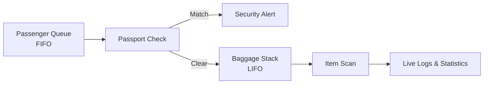

# Airport Security Simulator

[](https://github.com/abdulhadi545/airport-security-simulator/actions/workflows/ci.yml)


An interactive airport baggage-screening simulation that turns core data structures into a visible, real-time workflow. Passengers enter a FIFO queue, baggage items are inspected through a LIFO stack, and passport numbers are checked against a linked-list blacklist.

> Educational simulation only. It does not model or replace real airport security procedures.

## Why this project

Data structures are often taught as isolated operations. This project connects them to a single operational scenario and makes every transition visible through live panels, event logs, alerts, and statistics.

## Core workflow



## Highlights

- FIFO passenger processing with a custom queue implementation
- LIFO baggage inspection with a custom stack implementation
- Linked-list lookup for simulated passport blacklist checks
- Animated, step-by-step screening workflow
- Live operational logs and security alerts
- Simulation statistics and CSV report export
- English, Turkish, and Arabic interface support
- Responsive interface with light and dark themes
- Automated tests for the core data structures and reporting
- Continuous integration for linting, tests, and production builds

## Data structures

| Structure | Responsibility | Key operations |
| --- | --- | --- |
| Queue | Preserve passenger arrival order | `enqueue`, `dequeue`, `peek` |
| Stack | Inspect baggage in last-in-first-out order | `push`, `pop`, `peek` |
| Linked list | Store and search simulated blacklist entries | `add`, `contains`, `toArray` |

## Technology

- React 18 and TypeScript
- Vite
- Tailwind CSS
- Radix UI primitives
- Framer Motion
- Vitest
- ESLint
- GitHub Actions

## Run locally

Requirements: Node.js 20 or newer.

```bash
git clone https://github.com/abdulhadi545/airport-security-simulator.git
cd airport-security-simulator
npm install
npm run dev
```

Open the local URL printed by Vite.

## Quality checks

```bash
npm run lint
npm run test
npm run build
```

Run all checks in sequence:

```bash
npm run check
```

## Project structure

```text
src/
├── components/       Simulation panels and controls
├── hooks/            Simulation and theme state
├── models/           Passenger and baggage types
├── pages/            Application routes
└── utils/            Data structures, generators, reports, translations
```

## Privacy and scope

- All passengers, passport numbers, flights, and baggage records are generated synthetic data.
- No external airport, passenger, or government data source is used.
- The blacklist is generated locally for demonstration.
- The project runs entirely in the browser and does not collect personal data.

## Possible extensions

- Configurable checkpoint lanes and processing speed
- Deterministic simulation seeds for reproducible experiments
- Performance comparisons between lookup strategies
- Additional accessibility and keyboard-navigation coverage
- Historical simulation charts and downloadable summaries

## Author

**Abdulhadi Hamid**  
Computer Engineering Student · AI & Software Developer

- [GitHub](https://github.com/abdulhadi545)
- [LinkedIn](https://www.linkedin.com/in/abdulhadi-hamid-bb7084372/)
- Email: [bh127924@gmail.com](mailto:bh127924@gmail.com)

## License

Released under the [MIT License](LICENSE).
